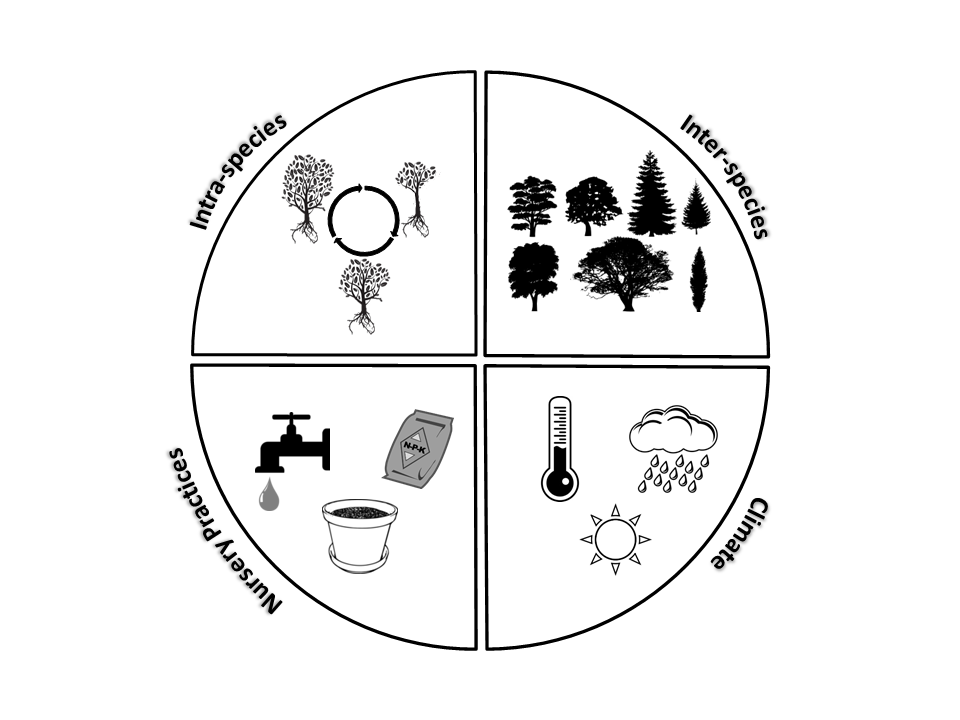

```{r setup, results='asis', echo=FALSE, warning=FALSE}
library(knitr)
opts_knit$set(root.dir = '../')
```

```{r data, message=FALSE}
standard <- read.csv("reports/container_assessment.csv")
  standard$logminSI <- with(standard, log10(min_size_index))
  standard$logmaxSI <- with(standard, log10(max_size_index))
  standard$logvol <- with(standard, log10(container_volume))

  minx <- min(standard$logvol)
  maxx <- max(standard$logvol)
  minsimin <- min(standard$logminSI)
  maxsimin <- max(standard$logminSI)
  minsimax <- min(standard$logmaxSI)
  maxsimax <- max(standard$logmaxSI)


alpine_dat <- read.csv("reports/alpine_sizeindex.csv")
#format raw dataframe

  ##need to replace 'mm' plots with appropriate volume
  alpine_dat$volume <- gsub("300mm", 15, alpine_dat$volume)
  alpine_dat$volume <- gsub("400mm", 35, alpine_dat$volume)
  alpine_dat$volume <- gsub("500mm", 65, alpine_dat$volume)
  alpine_dat$volume <- as.numeric(alpine_dat$volume)

  #units and date formatting
  alpine_dat$height_m <- alpine_dat$height/100
  alpine_dat$date <- as.Date(alpine_dat$date, format = "%d/%m/%Y", tz="AEST")

  #calulate indices
  alpine_dat$calliper300 <- with(alpine_dat, (diameter1+diameter2)/2)
  alpine_dat$rcd <- with(alpine_dat, (rcd1+rcd2)/2)
  alpine_dat$sizeindex <- with(alpine_dat, height_m * calliper300)
  alpine_dat$slenderness1 <- with(alpine_dat, height_m/rcd)
  alpine_dat$slenderness2 <- with(alpine_dat, height_m/calliper300)
  #log data for plotting
  alpine_dat$logSI <- with(alpine_dat, log10(sizeindex))
  alpine_dat$logvol <- with(alpine_dat, log10(volume))
  alpine_dat$logH <- with(alpine_dat, log10(height_m))
  alpine_dat$logD <- with(alpine_dat, log10(calliper300))
  alpine_dat$logRCD <- with(alpine_dat, log10(rcd))
  alpine_dat$logslender <- with(alpine_dat, log10(slenderness2))
  
  library(scales)
  library(magicaxis)
  library(RColorBrewer)

appdat <- alpine_dat[, c("logSI","logvol", "species")]
species <- as.character(unique(alpine_dat$species))
silab <- expression(Size~index~range~~(calliper~x~height))
greytrans <- scales::alpha("grey", alpha=0.25)
blacktrans <- scales::alpha("black", alpha=0.6)
###large color palette
n <- 23
qual_col_pals = brewer.pal.info[brewer.pal.info$category == 'qual',]
col_vector = unlist(mapply(brewer.pal, qual_col_pals$maxcolors, rownames(qual_col_pals)))
speciesnames <- unique(alpine_dat$species)
speciesnames2 <- data.frame(species = speciesnames, colorspec = col_vector[1:23])

redtrans <- scales::alpha("red4", alpha=0.5)
appdat <- merge(appdat, speciesnames2)
```


## Research Aims

Last week we visited Alpine Nursery in Dural, NSW.  The goal of this visit, and the many to come, are to evaluate the new Australian Standard for assessing tree stock for landscape use (AS2303).  Specifically, we are aiming to investigate how well the *Size Index* parameter accurately captures tree above and belowground balance in containerized trees.

\
In a little more detail, we want to see if this *Size Index* parameter can capture enought of the variation that exists within tree stock and across production nurseries.  This variation can be broadly conceptualized in 4 categories:

<div style="width:1000px; height=1000px;" align=center>

</div>

## Protocol
\
<div style="width:500px; height=500px;" align=center>

</div>

## Research Visit Summary

With the help of several staff at Alpine Nursery we were able to measure 920 trees. This included 23 tree species across 15 different container sizes.  We measured trees in 57 batches, ranging from 1 to 45 trees in each batch.


## Data Summary
 Lets see how the 'ready to sell' trees at Alpine fit in the range of *Size Index" values specified in AS2303.


## Inputs and Outputs

You can embed Shiny inputs and outputs in your document. Outputs are automatically updated whenever inputs change.  This demonstrates how a standard R plot can be made interactive by wrapping it in the Shiny `renderPlot` function. The `selectInput` and `sliderInput` functions create the input widgets used to drive the plot.


alpine SI

```{r sizeindex, echo=FALSE}
pageWithSidebar(
  
  headerPanel('Evaluating Tree Size Index'),
    sidebarPanel(
    ##type selection
    checkboxGroupInput("whichspecies", "Pick a Species:",species)
      ),
  mainPanel(
    plotOutput('plot1'
               ,brush=brushOpts("plot_brush",resetOnNew = TRUE, fill = "blue", opacity=.5, stroke="black"),
                width=800, height=600),
               verbatimTextOutput("brushedPoints")
    ))


    species_ss<- reactive({subset(appdat, species %in% input$whichgrowth)[,-c(3:4)] 
                      })
    species.color <- reactive({unique(subset(appdat, species %in% input$whichspecies)[,c(3,4)])
                      })
      
  output$plot1 <- renderPlot({
    
    par(mar=c(6,7,2,2),cex.axis=1.4, cex.lab=1.75,las=0,mgp=c(4.5,1,0))
    plot(appdat$logSI~ appdat$logvol,
         axes=FALSE, xlim=c(.5,3.75), ylim=c(.5,3.5),
         pch = 1, cex = 2, ylab=silab,
         xlab="Container volume (L)")
    magaxis(side=c(1,2), unlog=c(1,2), frame.plot=FALSE)
    
    #add assessment range
    polygon(x=c(minx,minx,maxx,maxx), y=c(minsimin, minsimax, maxsimax,maxsimin), lwd=2,lty=2, col=greytrans )
    box()
    
    ###reactive here for species colors
    points(species_ss()[[1]]~ species_ss()[[2]], bg=species.color()[,2], pch=21, cex=2)
 })
  
  output$brushedPoints <- renderPrint({
    rows <- brushedPoints(appdat[,c(1:3)], input$plot_brush,xvar = "logvol", yvar = "logSI")
    cat("Selected points:\n")
    print(rows)
  })

```


