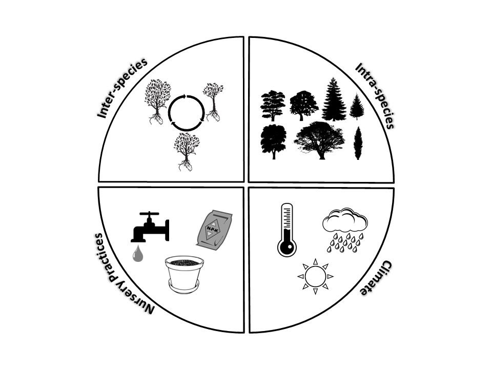

```{r setup, results='asis', echo=FALSE, warning=FALSE}
library(knitr)
opts_knit$set(root.dir = '../')

```

```{r alpinedata}
#read data
standard <- read.csv("data/container_assessment.csv")
  standard$logminSI <- with(standard, log10(min_size_index))
  standard$logmaxSI <- with(standard, log10(max_size_index))
  standard$logvol <- with(standard, log10(container_volume))
  minx <- min(standard$logvol)
  maxx <- max(standard$logvol)
  minsimin <- min(standard$logminSI)
  maxsimin <- max(standard$logminSI)
  minsimax <- min(standard$logmaxSI)
  maxsimax <- max(standard$logmaxSI)
  
alpine_dat <- read.csv("reports/alpine_sizeindex.csv")
#format raw dataframe

  ##need to replace 'mm' plots with appropriate volume
  alpine_dat$volume <- gsub("300mm", 15, alpine_dat$volume)
  alpine_dat$volume <- gsub("400mm", 35, alpine_dat$volume)
  alpine_dat$volume <- gsub("500mm", 65, alpine_dat$volume)
  alpine_dat$volume <- as.numeric(alpine_dat$volume)
  #units and date formatting
  alpine_dat$height_m <- alpine_dat$height/100
  alpine_dat$date <- as.Date(alpine_dat$date, format = "%d/%m/%Y", tz="AEST")
  #calulate indices
  alpine_dat$calliper300 <- with(alpine_dat, (diameter1+diameter2)/2)
  alpine_dat$rcd <- with(alpine_dat, (rcd1+rcd2)/2)
  alpine_dat$sizeindex <- with(alpine_dat, height_m * calliper300)
  alpine_dat$slenderness1 <- with(alpine_dat, height_m/rcd)
  alpine_dat$slenderness2 <- with(alpine_dat, height_m/calliper300)
  #log data for plotting
  alpine_dat$logSI <- with(alpine_dat, log10(sizeindex))
  alpine_dat$logvol <- with(alpine_dat, log10(volume))
  alpine_dat$logH <- with(alpine_dat, log10(height_m))
  alpine_dat$logD <- with(alpine_dat, log10(calliper300))
  alpine_dat$logRCD <- with(alpine_dat, log10(rcd))
  alpine_dat$logslender <- with(alpine_dat, log10(slenderness2))
  
  greytrans <- scales::alpha("grey", alpha=0.25)

```


## Research Aims
Last week we visited Alpine Nursery in Dural, NSW. The goal of this visit, and the many to come, are to evaluate the new Australian Standard for assessing tree stock for landscape use (AS2303). Specifically, we are aiming to investigate how well the **Size Index** parameter accurately captures tree above and belowground balance in containerized trees. The **Size Index** parameter is the height x calliper (300mm) of a given tree at time of dispatch and is stated to be a measure of the aboveground bulk of a tree. In the standard, a specific min/max **Size Index** value is then specified for the volume of container a seedling is currently in. As a result, trees that are deemed "ready to sale" by the nursery should have a **Size Index** value within the min/max range in order to pass the assessment.

\
We aim to test whether the specified range of **Size Index** values accurately captures enough of the variation that exists within tree stock and across production nurseries. This variation can be broadly conceptualized in 4 categories:

<div style="width:1000px; height=1000px;" align=center>

</div>

## Protocol
\
<div style="width:700px; height=700px;" align=center>

</div>

## Research Visit Summary
With the help of several staff at Alpine Nursery we were able to measure 
```{r numbertrees, echo=FALSE, results='asis'}
print(nrow(alpine_dat))
```
trees. This included 22 tree species across 15 different container sizes.  Container volumes ranged from 15L to 2000L, which nearly covers the entire spectrum of the AS2303 tree stock balance ***Size Index*** range. We assessed 57 total batches, measuring anywhere from 1 to 45 trees in each batch. The research visit was completed in a total of 4 days. Using a staging area, the above and belowground visual assessments were quickly completed for all tree stock in containers up to 45L. Larger containers were then assessed by visiting individual tree stock batches across the nursery.  One tree was initially assessed for each batch. If this tree failed (i.e. J-rooting) then the option was given to the production manager to assess additional trees. On the following days, measurements of size index variables and categorical shape parameters were completed in batches that passed the above and belowground testing process.

## Data Summary
 Lets see how the 'ready to sell' trees at Alpine fit in the range of *Size Index" values specified in AS2303.

```{r si, warning=FALSE, message=FALSE,fig.align='center' }
library(magicaxis)
library(RColorBrewer)

##plotbits
silab <- expression(Size~index~range~~(calliper~x~height))
###large color palette
n <- 30
qual_col_pals = brewer.pal.info[brewer.pal.info$category == 'qual',]
col_vector = unlist(mapply(brewer.pal, qual_col_pals$maxcolors, rownames(qual_col_pals)))

#1. size index vs volume
par(mar=c(5,5,1,1),cex.axis=1, cex.lab=1.25,las=0,mgp=c(3,1,0))
plot(logSI ~ logvol, data=alpine_dat, xlab="Container volume (L)", ylab=silab,
     axes=FALSE, cex=1.25, bg=col_vector[alpine_dat$species],pch=21, xlim=c(.5,3.75), ylim=c(.5,3.5))
magicaxis::magaxis(side=c(1,2), unlog=c(1,2), frame.plot=FALSE)

#add assessment
# points(log10(min_size_index[1:36])~log10(container_volume[1:36]), data=standard, bg="grey65",   type='l',lwd=2)
# points(log10(max_size_index[1:36])~log10(container_volume[1:36]), data=standard, col="black",  type='l', lwd=2)

polygon(x=c(minx,minx,maxx,maxx), y=c(minsimin, minsimax, maxsimax,maxsimin), lwd=2,lty=2, col=greytrans )
    box()

legend("topleft", c("Max. size index", "Min. size index") ,pch=c(16, 21), cex=1.25, bty='n', inset=.01)
box()

```


The big trees seem to level off at the largest container volumes.  Is that due to height or calliper?

```{r height,warning=FALSE, message=FALSE,fig.align='center'}
par(mar=c(5,5,1,1),cex.axis=1, cex.lab=1.25,las=0,mgp=c(3,1,0))
plot(logH ~ logvol, data=alpine_dat, xlab="Container volume (L)", ylab="Height (m)",
     axes=FALSE, cex=1.25, bg=col_vector[alpine_dat$species],pch=21, xlim=c(.5,3.75), ylim=c(-.5,1))
magicaxis::magaxis(side=c(1,2), unlog=c(1,2), frame.plot=FALSE)

box()
```


\
```{r calliper,warning=FALSE, message=FALSE,fig.align='center'}
par(mar=c(5,5,1,1),cex.axis=1, cex.lab=1.25,las=0,mgp=c(3,1,0))
plot(logD ~ logvol, data=alpine_dat, xlab="Container volume (L)", ylab="Stem Calliper @ 300mm (mm)",
     axes=FALSE, cex=1.25, bg=col_vector[alpine_dat$species],pch=21, xlim=c(.5,3.75), ylim=c(.5,2.25))
magicaxis::magaxis(side=c(1,2), unlog=c(1,2), frame.plot=FALSE)

box()
```


How related are height and calliper in these trees?
```{r hieghtdiam,  warning=FALSE, message=FALSE,fig.align='center'}
par(mar=c(5,5,1,1),cex.axis=1, cex.lab=1.25,las=0,mgp=c(3,1,0))
plot(calliper300 ~ height_m, data=alpine_dat, xlab="Height (m)", ylab="Diameter (mm)",xlim=c(0,8), ylim=c(0,175),
     cex=1.25, col=col_vector[alpine_dat$species],pch=1)

points(rcd ~ height_m, data=alpine_dat, cex=1.25, bg=col_vector[alpine_dat$species],pch=21)
box()

legend("topleft", c("Root Collar Diameter","Calliper @ 300mm") ,pch=c(16, 1), bg="black", cex=1, bty='n', inset=.01)
```

#Whats Next?
Research visit #2 is set for Andreasens Green nursery from May 23-27, 2016. There is an option to visit Trees Impact and measure some larger trees shortly after. Then we will begin interstate visits. Specialty Trees and Fleming's nurseries next???
\
\

